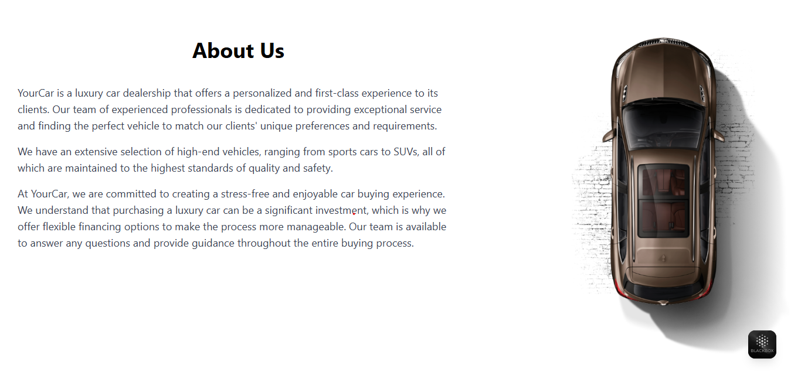

# React + TypeScript + Vite

This template provides a minimal setup to get React working in Vite with HMR and some ESLint rules.

## Car Sales ReactJS

This project is a modern car sales web application built with ReactJS, TypeScript, Tailwind CSS, and Vite. It allows users to browse a selection of cars, add them to a cart, and view their selected cars in a stylish sidebar. The UI is designed to be clean, responsive, and user-friendly, with features such as:

- Home page with hero section and navigation bar
- Car listing with quantity controls and add-to-cart functionality
- Cart sidebar that slides in from the side, showing selected cars and allowing removal
- About, Services, Brands, Testimonials, and Footer sections
- Beautiful styling using Tailwind CSS

## Screenshots

### Home Page & Hero Section

### AboutUs 

### Car Listing & Add to Cart

### Testimonials

### Footer

## Getting Started

1. Clone the repository
2. Run `npm install` to install dependencies
3. Run `npm run dev` to start the development server
4. Open your browser at `http://localhost:5173` (or the port shown in your terminal)

## Technologies Used

- ReactJS
- TypeScript
- Tailwind CSS
- Vite

## License

MIT

